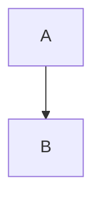
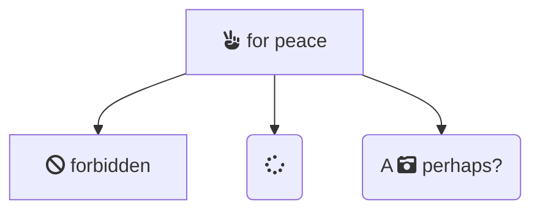
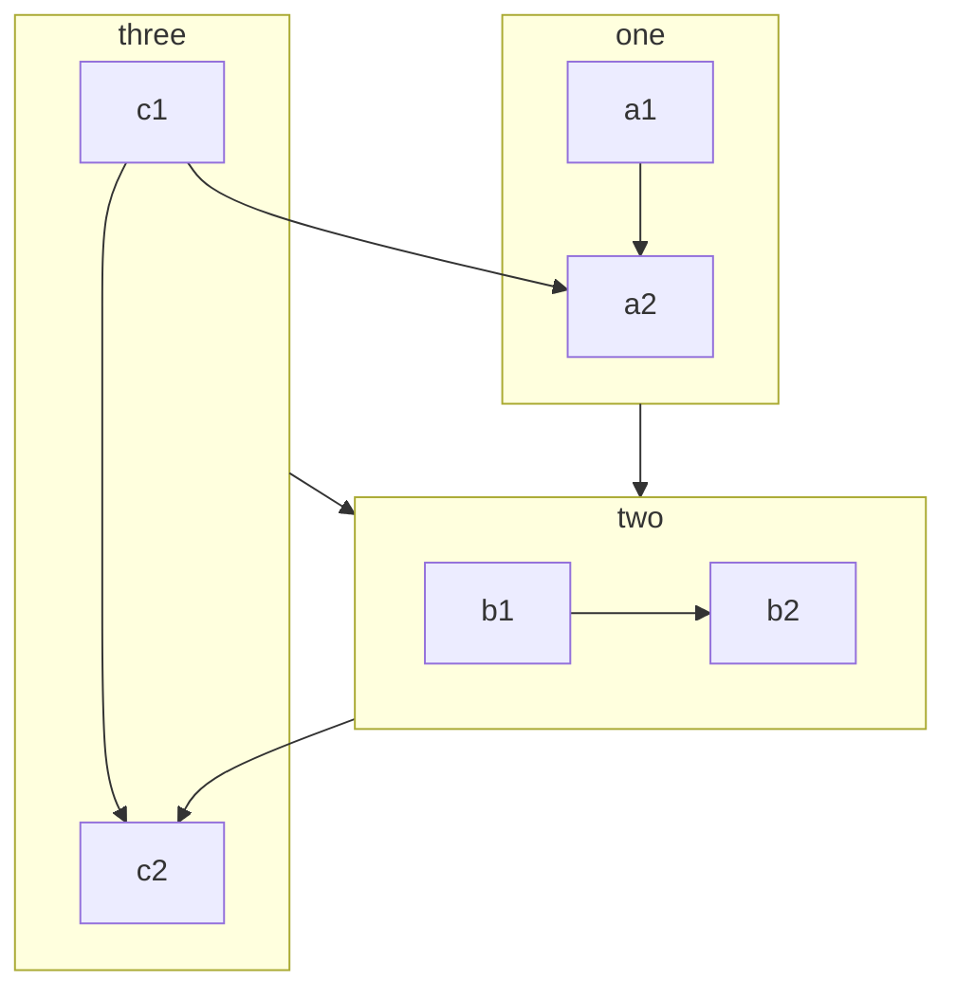
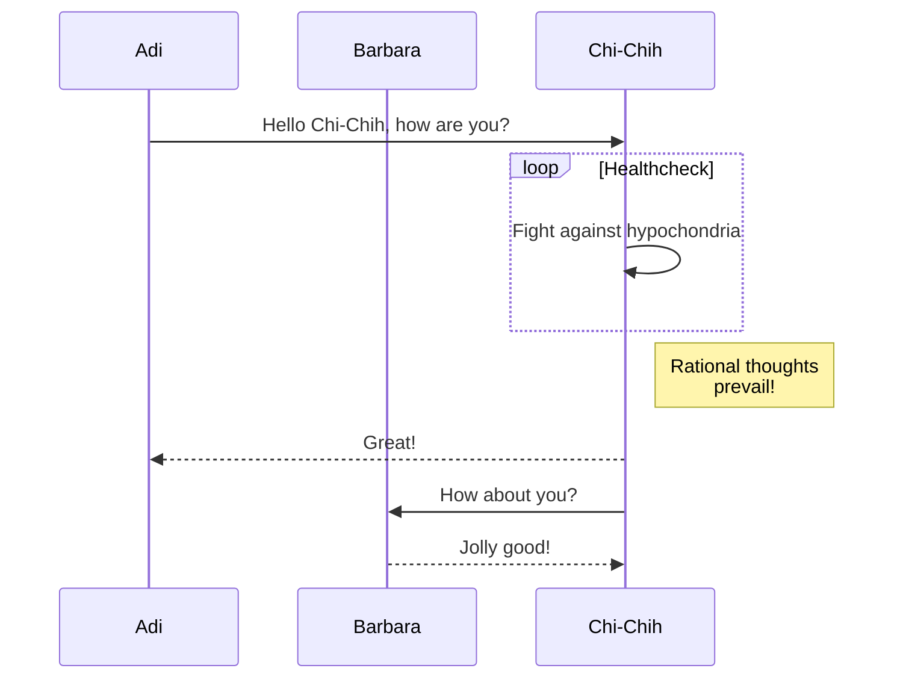
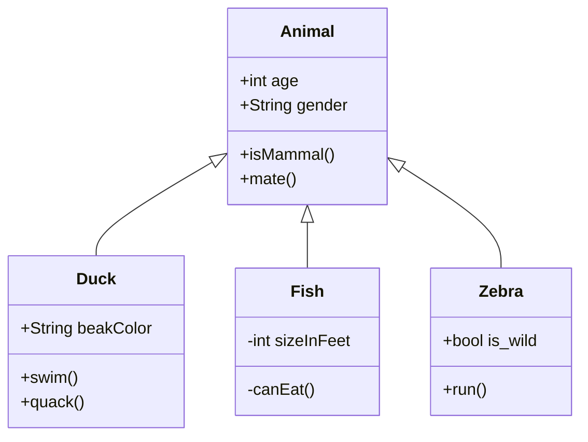
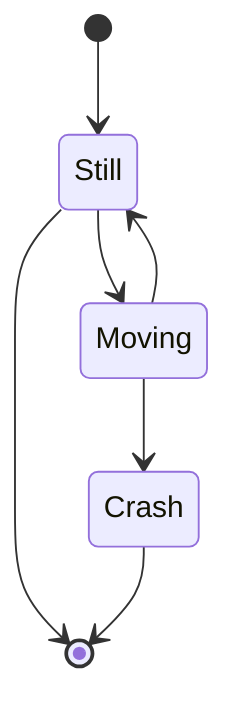

# Diagrams
{: .primer-spec-toc-ignore }

Primer Spec offers first-class support for two diagramming tools:

- [Excalidraw](#excalidraw): Use for free-form whiteboard-style diagrams.
- [Mermaid](#mermaid): Use for structured flowcharts and sequence diagrams.

# Excalidraw

[Excalidraw](https://excalidraw.com) is my preferred diagramming tool. It's _absurdly_ easy to create beautiful whiteboard-style diagrams! (It's also the preferred diagramming tool by engineers at Meta.)

You can visit their [website](https://excalidraw.com) and export the diagram as a PNG or SVG. Alternatively, you can use their [official VSCode extension](https://marketplace.visualstudio.com/items?itemName=pomdtr.excalidraw-editor) to create diagrams right in VSCode.

<div class="primer-spec-callout info" markdown="1">
When you create a PNG image using Excalidraw, don't forget to name your file as `[your-filename].excalidraw.png`. Primer Spec identifies images that are named with `.excalidraw`, and automatically applies dark-mode styles to them!
</div>

As long as you've "embedded the scene" into the exported image, your Excalidraw diagrams can be edited any time.

Here's a demo diagram I created with filename `excalidraw-demo.excalidraw.png`. Try switching between light and dark-mode to see the image-color change!


# Mermaid

[Mermaid](https://mermaid-js.github.io/mermaid/#/?id=diagram-types) lets you define diagrams (like flow charts and sequence diagrams) with easy-to-learn Markdown-ish syntax.

This page contains some examples of how you can use Mermaid in your specs!

## Usage

Just add `mermaid: true` to the front-matter of your spec page. For instance:

```plaintext
---
layout: spec
mermaid: true
---

# My Spec
...
```
{: data-title="my_spec.md" data-highlight="3" }

## Accessibility

Primer Spec allows you to specify _titles_ and _descriptions_ for your diagrams. While they aren't required, we strongly encourage you to specify them since they are the only way a visually-impaired user can understand the content in the diagram.

Specify them by adding `data-title` and `data-decsription` attributes to the diagram. For instance:

````markdown

{: data-title="A simple graph" data-description="A links to B." }
````
{: data-highlight="5" }

All of the demos on this site have titles and descriptions. We hope you'll include them in your diagrams too!

## Flowcharts

_Docs: [https://mermaid-js.github.io/mermaid/#/flowchart](https://mermaid-js.github.io/mermaid/#/flowchart)_

### Basic example


{:
  data-title="Basic example of a flowcchart"
  data-description="A links to B and C. B and C link to D."
}

<details markdown="1">
<summary>Show code</summary>

````markdown

{:
  data-title="Basic example of a flowcchart"
  data-description="A links to B and C. B links to D. C links to D."
}
````

</details>

### FontAwesome Icons


{:
  data-title="Diagram with font-awesome icons"
  data-description="B says, 'Peace gesture for peace'. B links to three boxes: C (which says 'forbidden'), D (which has a spinner icon), and E (which says 'a picture perhaps?')."
}

<details markdown="1">
<summary>Show code</summary>

````markdown

{:
  data-title="Diagram with font-awesome icons"
  data-description="B says, 'Peace gesture for peace'. B links to three boxes: C (which says 'forbidden'), D (which has a spinner icon), and E (which says 'a picture perhaps?')."
}
````

</details>

Look for FontAwesome icons on their website: [https://fontawesome.com/search?m=free](https://fontawesome.com/search?m=free)

### Subgraphs


{:
  data-title="Diagram with subgraphs"
  data-description="Three subgraphs, each containing two boxes. Subgraph one has box a1 linked to a2. Subgraph two has box b1 linked to b2. Subgraph 3 has box c1 linked to c2. Subgraph one links to subgraph two. Subgraph three links to subgraph two. Subgraph two links to c2."
}

<details markdown="1">
<summary>Show code</summary>

````markdown

{:
  data-title="Diagram with subgraphs"
  data-description="Three subgraphs, each containing two boxes. Subgraph one has box a1 linked to a2. Subgraph two has box b1 linked to b2. Subgraph 3 has box c1 linked to c2. Subgraph one links to subgraph two. Subgraph three links to subgraph two. Subgraph two links to c2."
}
````

</details>

## Sequence Diagrams

_Docs: [https://mermaid-js.github.io/mermaid/#/sequenceDiagram](https://mermaid-js.github.io/mermaid/#/sequenceDiagram)_

> A Sequence diagram is an interaction diagram that shows how processes operate with one another and in what order.


{:
  data-title="Example of a sequence diagram"
  data-description="Adi says hello to Chi-Chih. Loop Healthcheck shows that Chi-Chih is fighting against hypochondria. Note right of Chi-Chih says Rational thoughts prevail! Chi-Chih says Great! Chi-Chih says How about you? Barbara says Jolly good!"
}

<details markdown="1">
<summary>Show code</summary>

````markdown

{:
  data-title="Example of a sequence diagram"
  data-description="Adi says hello to Chi-Chih. Loop Healthcheck shows that Chi-Chih is fighting against hypochondria. Note right of Chi-Chih says Rational thoughts prevail! Chi-Chih says Great! Chi-Chih says How about you? Barbara says Jolly good!"
}
````

</details>

## Class diagrams

_Docs: [https://mermaid-js.github.io/mermaid/#/classDiagram](https://mermaid-js.github.io/mermaid/#/classDiagram)_

> "In software engineering, a class diagram in the Unified Modeling Language (UML) is a type of static structure diagram that describes the structure of a system by showing the system's classes, their attributes, operations (or methods), and the relationships among objects." Wikipedia


{:
  data-title="Example of a class diagram"
  data-description="Class Animal defines public attributes int age and String gender, and public methods isMammal() and mate(). Classes Duck, Fish and Zebra each inherit from Animal. Class Duck has public attribute String beakColor, and public methods swim() and quack(). Class Fish has private attribute int sizeInFeet, and public method canEat(). Class Zebra has public attribute bool is_wild, and public method run()."
}

<details markdown="1">
<summary>Show code</summary>

````markdown

{:
  data-title="Example of a class diagram"
  data-description="Class Animal defines public attributes int age and String gender, and public methods isMammal() and mate(). Classes Duck, Fish and Zebra each inherit from Animal. Class Duck has public attribute String beakColor, and public methods swim() and quack(). Class Fish has private attribute int sizeInFeet, and public method canEat(). Class Zebra has public attribute bool is_wild, and public method run()."
}
````

</details>

## State diagrams

_Docs: [https://mermaid-js.github.io/mermaid/#/stateDiagram](https://mermaid-js.github.io/mermaid/#/stateDiagram)_

> "A state diagram is a type of diagram used in computer science and related fields to describe the behavior of systems. State diagrams require that the system described is composed of a finite number of states; sometimes, this is indeed the case, while at other times this is a reasonable abstraction." Wikipedia


{:
  data-title="Example of a state diagram"
  data-description="From start, move to 'Still' state. From 'Still' state, move to either end or to 'Moving' state. From 'Moving' state, either move back to 'Still' state or to 'Crash' state. From 'Crash' state, move to end."
}

<details markdown="1">
<summary>Show code</summary>

````markdown

{:
  data-title="Example of a state diagram"
  data-description="From start, move to 'Still' state. From 'Still' state, move to either end or to 'Moving' state. From 'Moving' state, either move back to 'Still' state or to 'Crash' state. From 'Crash' state, move to end."
}
````

</details>
