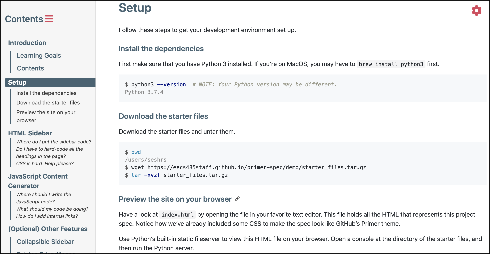

# Images
{: .primer-spec-toc-ignore }

# Basic syntax

Primer Spec automatically adds a subtle `1px` border to images. In my opinion, the border helps with readability, especially for images whose background colors match the background of the page.

For instance, try viewing this image in the "default" theme in "light" mode:

You can use either Markdown syntax or HTML syntax to define images.

Source code for basic image syntax

<pre data-title="Basic image syntax">
Markdown syntax:

Equivalent HTML syntax:
&lt;img
  src="./screenshot.png"
  alt="This image shows a screenshot of Primer Spec in the 'Bella' theme." /&gt;
</pre>

Don't forget the 'alt' text! It's the only way fot visually-impaired users to understand the context provided by the image.

# Opt-out of image borders

Simply add the `no-border` class to the image. For instance:

{: .no-border }

Source code for borderless images

<pre data-title="Auto-inverted image syntax">
Markdown syntax:
{: .no-border }

Equivalent HTML syntax:
&lt;img
  src="./screenshot.png"
  alt="This image shows a screenshot of Primer Spec in the 'Bella' theme."
  class="no-border" /&gt;
</pre>

# Supporting dark mode

Primer Spec supports built-in dark mode themes, which invert the background and foreground colors on the page. Primer Spec is able to invert most colors automatically, but *cannot* automatically handle images on your pages.

You'll need to opt-in to these optimizations to better support your dark mode users. Primer Spec offers you two easy options to add dark mode support for your images:

- [**Option 1 *(recommended)***](#option-1-recommended-auto-invert-image-colors-in-dark-mode): Ask Primer Spec to auto-invert your image!
- [**Option 2**](#option-2-show-images-only-in-certain-theme-mode): Create two separate images (one optimized for light mode, the other for dark mode)

## Option 1 (recommended): Auto-invert image colors in dark mode

If you add the `invert-colors-in-dark-mode` class to an image, Primer Spec will automatically invert the colors of the image when users view the page in a dark theme!

For instance, the following image changes colors in light mode and dark mode:

{: .invert-colors-in-dark-mode }

Source code for auto-inverted images

<pre data-title="Auto-inverted image syntax">
Markdown syntax:
{: .invert-colors-in-dark-mode }

Equivalent HTML syntax:
&lt;img
  src="./screenshot.png"
  alt="This image shows a screenshot of Primer Spec in the 'Bella' theme."
  class="invert-colors-in-dark-mode" /&gt;
</pre>

## Option 2: Show images only in certain theme mode

You can specify that an image is only shown in light mode or dark mode by appending `#gh-dark-mode-only` or `#gh-light-mode-only` to the end of an image URL.

<table>
<tr><th>Context</th><th>URL</th></tr>
<tr>
  <td>Light mode</td>
  <td><code></code></td>
</tr>
<tr>
  <td>Dark mode</td>
  <td><code></code></td>
</tr>
</table>

For instance, I created two different versions of the Primer Spec logo:

<table>
<tr><th>Light mode</th><th>Dark mode</th></tr>
<tr>
  <td></td>
  <td></td>
</tr>
</table>

However, I only want to show the correct version of the image depending on the theme mode. The following image dynamically displays the correct version of the logo when you change the theme between light and dark modes!

Source code for auto-switching logo

<pre data-title="Auto-switching logo syntax">
Markdown syntax:

Equivalent HTML syntax:
&lt;img
  src="./logo-light.svg#gh-light-mode-only"
  alt="Light mode version of Primer Spec logo" /&gt;
&lt;img
  src="./logo-dark.svg#gh-dark-mode-only"
  alt="Dark mode version of Primer Spec logo" /&gt;
</pre>

# [Excalidraw](https://excalidraw.com)

While you can use [Mermaid](https://eecs485staff.github.io/primer-spec/demo/mermaid-diagrams.html) to create diagrams, I recommend using [Excalidraw](https://excalidraw.com) for creating free-form diagrams.

After you've created your diagram on Exccalidraw, I recommend exporting it as a PNG *with the scene embedded*. ("Embedding the scene" allows you to reopen the PNG file on Excalidraw in future to make updates!)

Upload the exported PNG image to your Primer Spec website. Then, when you add the image to your page, don't forget to [auto-invert the colors](#auto-invert-colors-in-dark-mode)!
