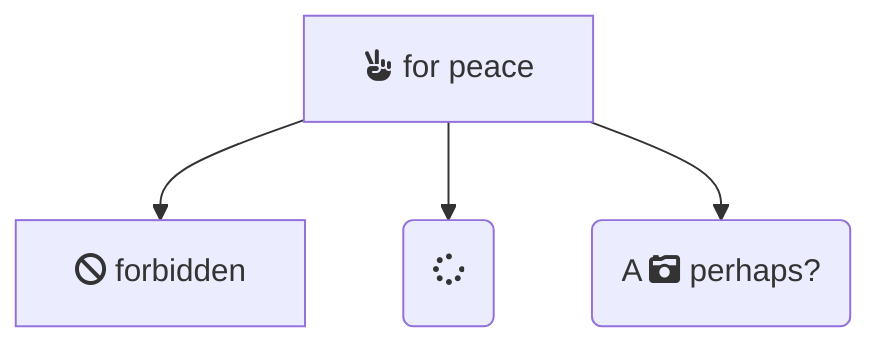
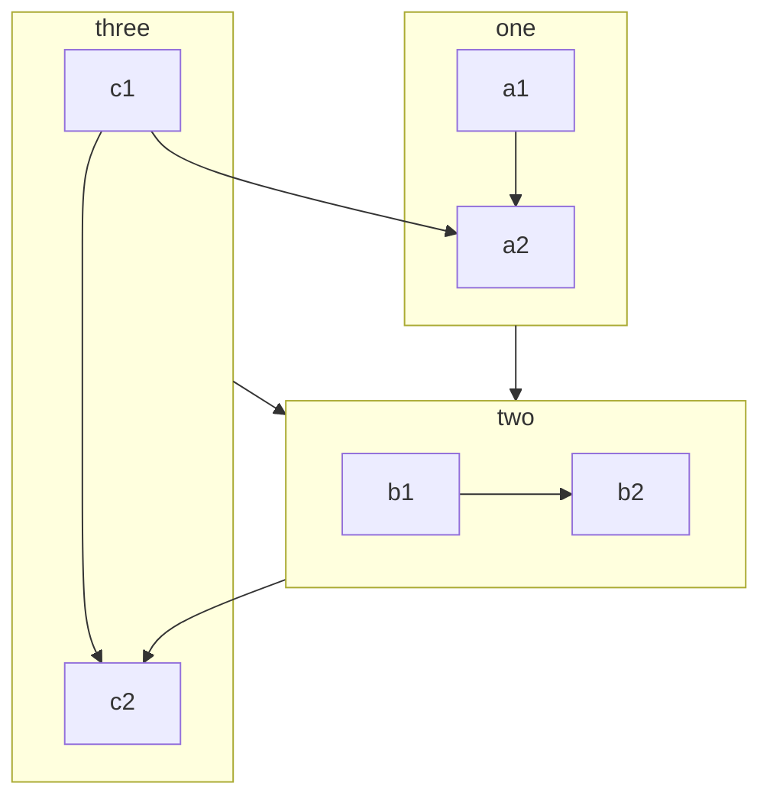
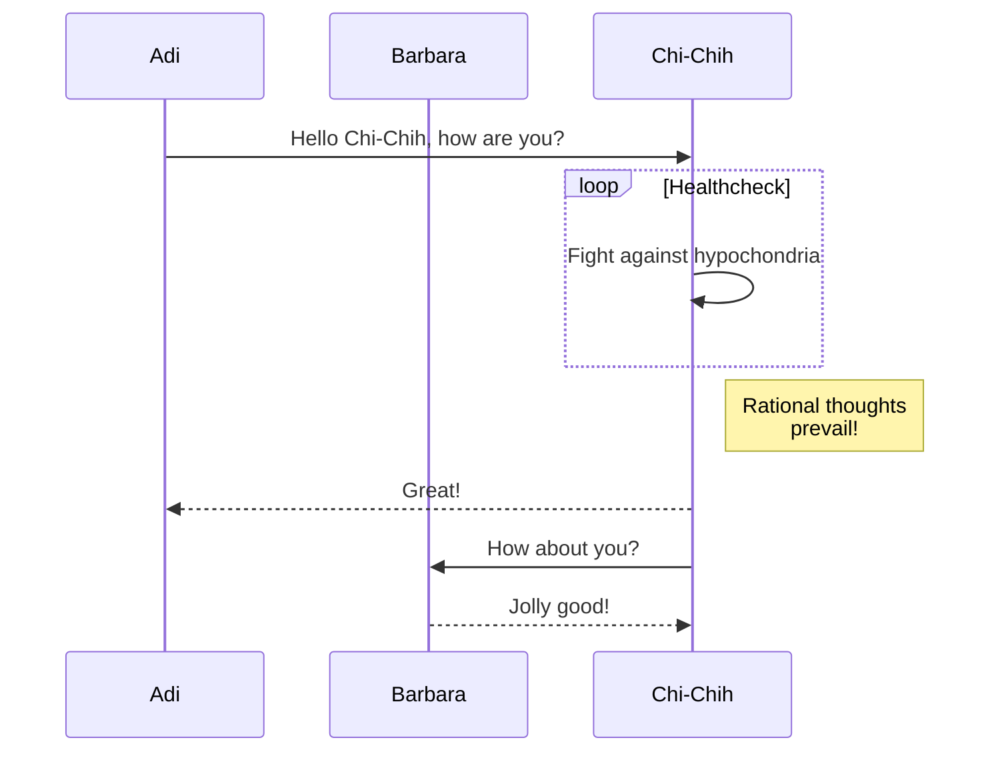
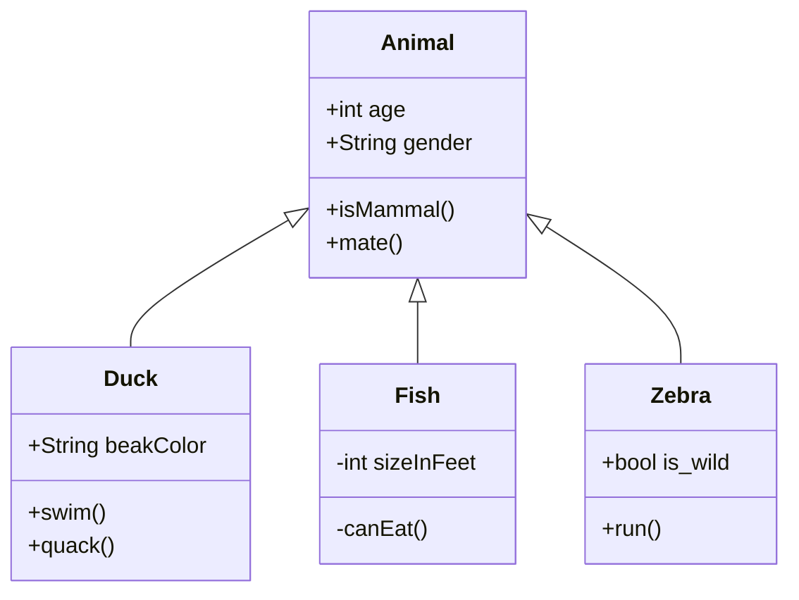
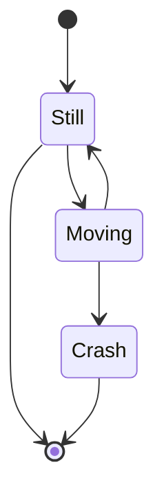

<!-- prettier-ignore-start -->
# Mermaid Diagrams
{: .primer-spec-toc-ignore }
<!-- prettier-ignore-end -->

[Mermaid](https://mermaid-js.github.io/mermaid/#/?id=diagram-types) lets you define diagrams (like flow charts and sequence diagrams) with easy-to-learn Markdown-ish syntax.

This page contains some examples of how you can use Mermaid in your specs!

## Usage

Just add `mermaid: true` to the front-matter of your spec page. For instance:

<!-- prettier-ignore-start -->
```plaintext
---
layout: spec
mermaid: true
---

# My Spec
...
```
{: data-title="my_spec.md" data-highlight="3" }
<!-- prettier-ignore-end -->

## Flowcharts

_Docs: [https://mermaid-js.github.io/mermaid/#/flowchart](https://mermaid-js.github.io/mermaid/#/flowchart)_

### Basic example


<details markdown="1">
<summary>Show code</summary>

````markdown

````

</details>

### FontAwesome Icons



<details markdown="1">
<summary>Show code</summary>

````markdown

````

</details>

Look for FontAwesome icons on their website: [https://fontawesome.com/search?m=free](https://fontawesome.com/search?m=free)

### Subgraphs



<details markdown="1">
<summary>Show code</summary>

````markdown

````

</details>

## Sequence Diagrams

_Docs: [https://mermaid-js.github.io/mermaid/#/sequenceDiagram](https://mermaid-js.github.io/mermaid/#/sequenceDiagram)_

> A Sequence diagram is an interaction diagram that shows how processes operate with one another and in what order.



<details markdown="1">
<summary>Show code</summary>

````markdown

````

</details>

## Class diagrams

_Docs: [https://mermaid-js.github.io/mermaid/#/classDiagram](https://mermaid-js.github.io/mermaid/#/classDiagram)_

> "In software engineering, a class diagram in the Unified Modeling Language (UML) is a type of static structure diagram that describes the structure of a system by showing the system's classes, their attributes, operations (or methods), and the relationships among objects." Wikipedia



<details markdown="1">
<summary>Show code</summary>

````markdown

````

</details>

## State diagrams

_Docs: [https://mermaid-js.github.io/mermaid/#/stateDiagram](https://mermaid-js.github.io/mermaid/#/stateDiagram)_

> "A state diagram is a type of diagram used in computer science and related fields to describe the behavior of systems. State diagrams require that the system described is composed of a finite number of states; sometimes, this is indeed the case, while at other times this is a reasonable abstraction." Wikipedia



<details markdown="1">
<summary>Show code</summary>

````markdown

````

</details>
